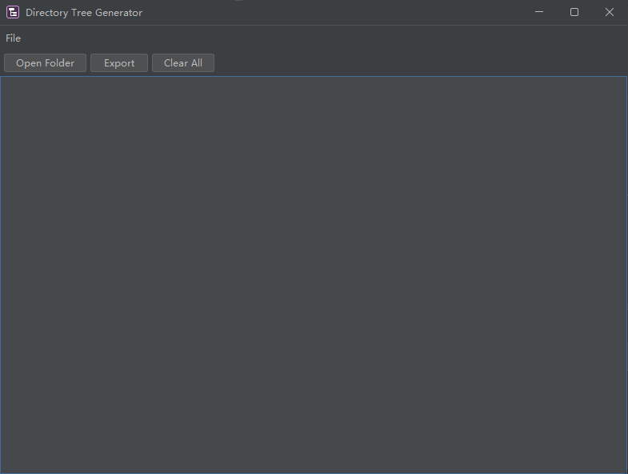
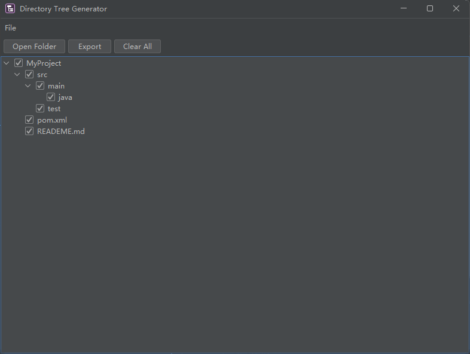

#  DirTreeGenerator

🚀 **DirTreeGenerator** is a lightweight desktop utility to generate **clean, readable directory tree structures** with configurable ignore rules.

Designed for developers who want to quickly document project structures in Markdown-friendly formats.

---

## 📋 Overview
📌 **Latest Version: `v2.1.0`**  
📌 **Supported Operating System: `Windows`**

---

## ✨ Features

- Generate directory trees with classic **tree-style formatting**
    ```text
    # A small demo for the formatting
    MyProject/
    ├── src/
    │ ├── main/
    │ │ └── java/
    │ └── test/
    ├── pom.xml
    └── README.md
    ```
- **Blacklist / Whitelist filtering**
    - Ignore unwanted files or folders
    - Or only include explicitly listed entries
- Select only the folders you want before exporting
- Save output to file with one click
- Modern dark UI powered by **FlatLaf**

---

## 📥 Quick Start
### 1️⃣ Download
👉  [Click here to download **DirTreeGenerator**.](https://github.com/X-xiaohan521/PlayerTracker/releases/)

### 2️⃣ Installation
1. Download the `.exe` file.
2. Run it.

> That's it, nothing else required. (No Java installation required, as JRE is bundled.)

---

## 🧭 How to Use
1. Click `Open Folder` to choose a root directory.
    
2. The directory tree will be generated and displayed.
   
3. Select the directories you want to export (or de-select the unwanted ones)
4. Click `Export` to export the result to a text file
5. **(Optional)** Open `Settings` to configure:
   - Filter mode (Blacklist / Whitelist)
   - Ignore rules
   - Default expanding layers

---

## ⚙️ Settings & Configuration
### 📄 Configuration File `config.json`
> 📌 Automatically generated at `C:\Users\<username>\AppData\Roaming\DirTreePrinter` on first launch.
```json
{
  "defaultExpandedLayers":3,
  "filterMode":"BLACKLIST",
  "rules":[".idea",".git","target"],
  "modified":false
}
```
- defaultExpandedLayers: how many layers of folders will be expanded by default when a tree is displayed
- filterMode: how will the ignore rules be applied
  - BLACKLIST → exclude listed names
  - WHITELIST → only include listed names
- rules: the folders or files you specify

> [!NOTE]
> All the settings in `config.json` can be configured **in the settings panel of DirTreePrinter app**, if you really want to change the configs manually, restart the app for the changes to take effect.
---

## 🛠️ Technical Overview
### Project Structure
> Generated by DirTreeGenerator:
```text
DirTreePrinter/
├── src
│   ├── main
│   │   ├── java
│   │   │   └── unimilk
│   │   │       └── dirtreeprinter
│   │   │           ├── api
│   │   │           │   ├── settings
│   │   │           │   │   ├── FilterMode.java
│   │   │           │   │   ├── ISettings.java
│   │   │           │   │   └── ISettingsManager.java
│   │   │           │   └── tree
│   │   │           │       ├── IDirTreeGenerator.java
│   │   │           │       ├── ITreeRenderer.java
│   │   │           │       └── TreeNode.java
│   │   │           ├── backend
│   │   │           │   ├── settings
│   │   │           │   │   ├── JsonSettingsManager.java
│   │   │           │   │   ├── Settings.java
│   │   │           │   │   └── YamlSettingsManager.java
│   │   │           │   ├── tree
│   │   │           │   │   ├── DirTreeGenerator.java
│   │   │           │   │   └── TreeRenderer.java
│   │   │           │   └── AppPaths.java
│   │   │           ├── frontend
│   │   │           │   ├── export
│   │   │           │   │   ├── ExportDialog.java
│   │   │           │   │   └── ExportPreviewDialog.java
│   │   │           │   ├── settings
│   │   │           │   │   ├── GeneralCard.java
│   │   │           │   │   ├── IgnoreRulesCard.java
│   │   │           │   │   ├── ListReorderTransferHandler.java
│   │   │           │   │   ├── SettingsCards.java
│   │   │           │   │   └── SettingsDialog.java
│   │   │           │   ├── tree
│   │   │           │   │   ├── CheckBoxTreeCellEditor.java
│   │   │           │   │   ├── CheckBoxTreeCellRenderer.java
│   │   │           │   │   ├── TreeCellClickListener.java
│   │   │           │   │   └── TreeDisplay.java
│   │   │           │   ├── worker
│   │   │           │   │   └── ScanWorker.java
│   │   │           │   ├── LoadingOverlayPanel.java
│   │   │           │   ├── MainFrontend.java
│   │   │           │   └── RightClickMenu.java
│   │   │           └── DirTreeApp.java
│   │   └── resources
│   │       ├── icons
│   │       │   ├── icon.ico
│   │       │   ├── icon16.png
│   │       │   ├── icon32.png
│   │       │   ├── icon48.png
│   │       │   └── icon64.png
│   │       └── config.yml
│   └── test
│       └── java
│           └── unimilk
│               └── dirtreeprinter
│                   ├── backend
│                   │   └── settings
│                   │       ├── JsonSettingsManagerTest.java
│                   │       └── SettingsTest.java
│                   └── frontend
│                       └── tree
│                           └── CheckBoxTreeCellRendererTest.java
├── .gitignore
├── CHANGELOG.md
├── LICENSE
├── pom.xml
└── README.md
```

### Technical Stack
* Java
* Swing
* FlatLaf
* Gson
* Maven
* exe4j

---

## 📦 Build From Source

### 1. Clone the Repo
```bash
git clone https://github.com/X-xiaohan521/DirTreePrinter.git
```
### 2. Buid Using Maven
```bash
mvn clean package
```
The executable JAR will be generated in: `target/`

---

## 📜 Changelog
> 📌 Only the latest version is listed here. See `CHANGELOG.md` for older versions.
### [2.1.0] - 2026-02-09

### 🆕 What's New
- Added a loading animation when scanning folders.
- Added a right-click menu, allowing sending to ignore rules or openning in file-explorer.
- Added a rescan button for rescanning the root folder.
- Add a rescan button for rescanning the root folder.
- Add default expanded layers setting.

### 🌟 Improvements
- Polished UI/UX experience.
- Allow drag to reorder for ignore rules.

### 🛠 Bugfixes
- Addressed frontend frozen issue when scanning tasks are performed.

---

## 💡 Contributing
### Want to help improve this software? Submit an **Issue** or **Pull Request** via GitHub.
- 🐛 Report issues: [🔗 GitHub Issues](https://github.com/X-xiaohan521/DirTreePrinter/issues)
- 💡 Suggest new features: [🔗 GitHub Issues](https://github.com/X-xiaohan521/DirTreePrinter/issues)
- 💬 Join discussions: [🔗 Github discussions](https://github.com/X-xiaohan521/DirTreePrinter/discussions)
- 🧩 Contribute code: Fork and submit a [🔗 Pull Request](https://github.com/X-xiaohan521/DirTreePrinter/pulls)

---

## 📜 License
### This plugin is released under the **MIT** license.
MIT License

Copyright (c) 2026 UniMilk

Permission is hereby granted, free of charge, to any person obtaining a copy
of this software and associated documentation files (the "Software"), to deal
in the Software without restriction, including without limitation the rights
to use, copy, modify, merge, publish, distribute, sublicense, and/or sell
copies of the Software, and to permit persons to whom the Software is
furnished to do so, subject to the following conditions:

The above copyright notice and this permission notice shall be included in all
copies or substantial portions of the Software.

---

## 📞 Contact Me
### 📧 Email: unimilk891@gmail.com
### 🌐 GitHub: [X-xiaohan521](https://github.com/X-xiaohan521/)

---

## ⭐ Final Words
### Thank you for using **DirTreeGenerator**!
If you find this tool helpful, please star ⭐ ths repository or leave your feedback — your support means a lot to me! 🚀